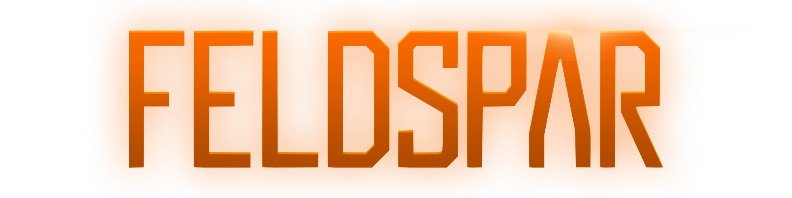

<p align="center"></img>
</img>
</img>
</img>
</p>

A voxel game written in Rust with the [Bevy](https://bevyengine.org/) engine.

Feldspar is an in-far-development voxel game focused on exploration and automation, in the style of modded Minecraft. The major inspiration for the project include the GregTech: New Horizons modpack, Factorio, Satisfactory, Terraria, and Hytale.

The full game will feature complex automation chains, train/vehicle design, spaceship design, space exploration, all dressed up in a unique art style including sci-fi and cosmic horror themes.

The project is currently deep in the development stage, and is barely playable. Still, anyone who is interested in trying out the game as it currently exists is welcome to do so. If you want to contribute to the project, please contact the repository owner SeiryuSolVT.

---

## What works today

### World & data model
- **Packed 32-bit voxels.** Each voxel encodes block id, shape, facing, and 9 reserved state bits in a single `u32`. Air is unconditionally `0`, which
  makes empty chunks trivially cheap.
- **Dense 16x16x16 chunks.** A single `VoxelChunk` storage type is shared between static world chunks and "moving grids" — distinguished only by a marker
  component, so the same meshing and interaction code works on both.
- **Multiple dimensions.** Static chunks are keyed by `(DimensionId, IVec3)` and registered in a global `StaticWorld` resource for O(1) fast lookup.
- **Multi-shape blocks.** Other than full cubes, blocks can be slabs, stairs, and slopes, each with a facing direction. Geometry is computed from canonical north-facing quads and rotated to match, and the meshing system takes care of rendering only the faces that are not occluded.

### Rendering
- **Custom voxel material.** An `ExtendedMaterial` wrapping `StandardMaterial` adds two 2D-array texture bindings (base + overlay) so any number of block
  faces can share a single draw call.
- **Per-face texturing.** Blocks can specify a uniform appearance, top/bottom/side, or fully per-face textures, with optional tinted overlays (e.g. grass).
- **Face culling against neighbors.** Each shape declares which faces fully cover a voxel boundary; the mesher uses that to drop occluded quads,
  including for non-cube shapes.

### World generation
- **Pluggable generator trait.** Any deterministic, `Send + Sync` function from `chunk_pos → chunk_contents` can be slotted in as the active generator.
- **Two generators implemented:** a flat world and an FBM-noise hills generators.

### Interaction
- **DDA raycasting** from the camera to find the block the player is looking at, including which face was hit.
- **Block placement and destruction** driven by mouse events and the player's currently held item.
- **Look target resource** that other systems (highlight, tooltips, future mob targeting) can read without re-raycasting.

### Inventory & items
- **Block & item registries** initialized at startup. Every block is automatically registered as a placeable item.
- **Inventory component** with a dual structure: an ordered `Vec` of slots for UI and slot-specific operations, plus a `HashMap` of totals for O(1)
  "how many of X do I have" queries (useful for future automation).
- **Player hotbar** with scroll-wheel selection, synced with the held-item resource and the UI highlight.

### UI & state
- **State machine** for game flow (`Loading` / `Running` / `Paused`) and UI layer (`Game` / `Menu`), with Escape toggling pause and cursor lock.
- **In-game HUD** with hotbar, item icons with stack counts, and crosshair.
- **Pause menu** scaffolded.

### Camera & controls
- Free-fly debug camera with mouse-look and WASD/Space/Shift movement.

---

## Building

Feldspar tracks Bevy's `main` branch. With a recent stable Rust toolchain:

```bash
cargo run --release
```

The dev profile is configured with `opt-level = 1` (and `opt-level = 3` for dependencies) so debug builds stay playable without the full release wait.

---

## Roadmap

- More complex meshing systems, including greedy meshing, mipmap, and LOD.
- More material definitions for a larger variety of materials (water, glass, etc).
- Chunk palette compression for potentially unlimited block variations (the scaffolding is already present).
- JSON-driven block and item definitions.
- Physics integration and a player controller.
- Integration of moving chunk grids for vehicle design.
- Multiple raycast targets (mobs → moving grids → static world).


---

## How to Contribute

### As a feature developer
Before sending a pull request, please contact the owner of the repository SeiryuSolVT. As this is a passion project and mostly solo, any help is appreciated. Rust developers and game artists of all backgrounds are welcome to discuss becoming part of the development team.

### Reporting Issues
Please understand that the project is very far in development, and issues are expected. However, until the project reaches a stable state, the developer(s) reserve the right to only resolve issues that seem relevant for the active development topic.

---

## Licensing & Disclaimers
- The project makes use of AI generated code to prototype ideas and write boilerplate code, or perform automated name changes. The developer(s) don't support generating code wholesale, instead encouraging deeply understanding their own code and type most of it out by hand before it's sent into production.
- The project is under MIT license. The code can be freely distributed, but profiting from it in terms of monetary gain is not permitted.
- Some temporary assets are taken from the .